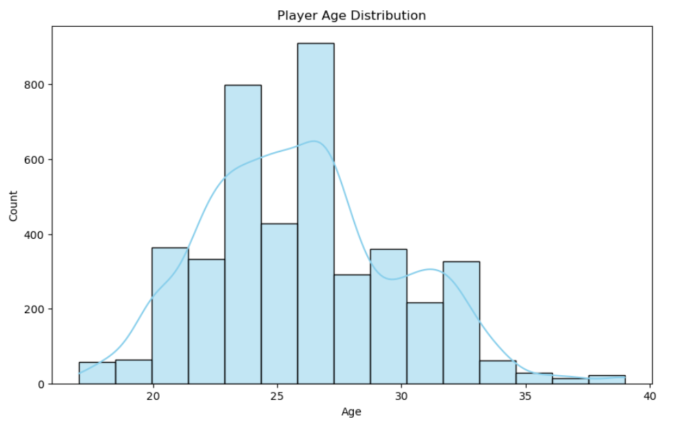
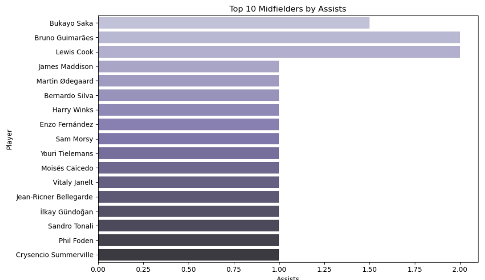
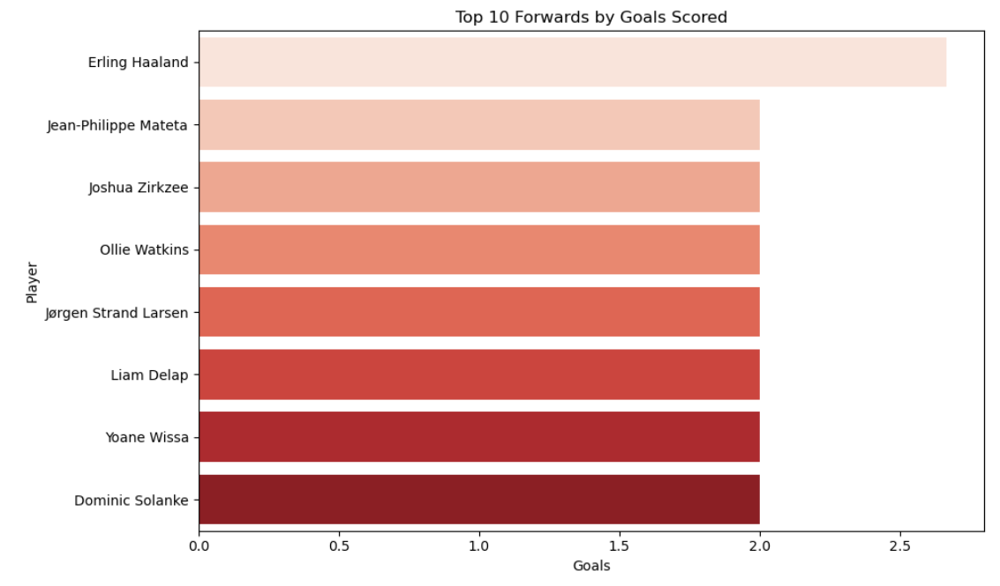
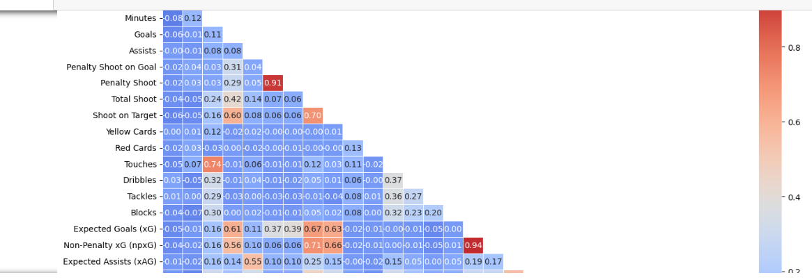
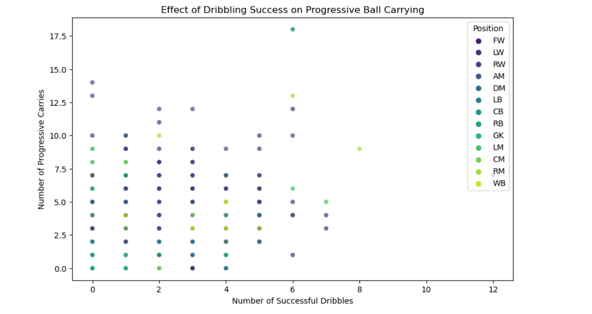

# Premier League Data Analysis

##  Project Overview
This project presents an in-depth analysis of the English Premier League (EPL) player statistics using Python. The goal is to explore key metrics to understand individual and team performance — with a focus on goal scoring, passing accuracy, dribbling success, and defensive contributions.

---

##  Objectives
- Identify top performers in goals, assists, tackles, and other key metrics.
- Understand how passing and dribbling influence progression and attack.
- Analyze the strongest offensive and defensive teams.
- Explore correlations between key football performance indicators.

---

##  Dataset
The dataset includes a wide range of player attributes:
- Player Name & Team
- Nationality, Position, Age
- Minutes Played, Goals, Assists
- Shots, Dribbles, Tackles, Cards
- xG, xAG, Progressive Passes & Carries
- Passing stats and more

---

##  Exploratory Data Analysis (EDA)

###  Age Distribution of Players

###  Top 10 Midfielders by Assists

###  Top Forwards by Goals Scored

###  Correlation Heatmap of Performance Metrics

###  Tactical Scatter Plot: Effect of Dribbling on Ball Carrying

---

## Key Insights
- **Chelsea** led the league in total goals scored, indicating the strongest attacking unit.
- Fullbacks and center-backs showed significant defensive stats, especially in tackling.
- Strong positive correlation observed between **Passes Attempted** and **Passes Completed**.
- Players with higher dribbling success also showed more **progressive carries**, indicating vertical attacking threat.

---

##  Technologies Used
- **Python**
- **Pandas**
- **Matplotlib**
- **Seaborn**
- **Jupyter Notebook**

---

## Author
**Khaled Elbialy**  
_Data Science Enthusiast | Football Analytics_

---

##  Connect with Me
- [LinkedIn](https://www.linkedin.com/in/khaled-elbialy-eng-ml)
- [GitHub](https://github.com/Loukyscience-ML)
- [WhatsApp](https://wa.me/201007887667)

---

>  All visuals were created using `Matplotlib` and `Seaborn`. This project can serve as a foundation for more advanced football analytics applications, such as predictive modeling and tactical simulations.
